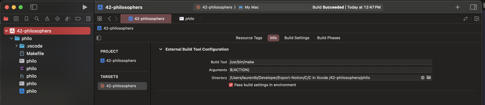

# 42-Xcode
How to use Xcode for Mac for C projects at 42 berlin
Xcode can be a powerful tool to debug your C and C++ programs on a mac. It is a bit more difficult to get started compared to other IDE's like visual studio code.  
Xcode is primarily used for Swift a app development for the apple platforms. Here I show how to set it up for a C project.  

# The easy way is to use Xcode as an editor only
In this mode you can configure a key stroke to use to open the terminal in a new window and use the normal 'make' commands to build and execute on the command line. In this way you cannot use xcode to debug your executable like you would with the steps described below.

# Use Xcode for build and execute.

## Create a project

Even if you have already a folder with your files and makefile you need to create a project in Xcode:

 

  &nbsp;&nbsp;&nbsp;&nbsp;&nbsp;

You will not be programming for iOS or macOS so click on the 'other' tab and chose external build system.  
This will allow to use 'make'.  
 

  &nbsp;&nbsp;&nbsp;&nbsp;&nbsp;

Give it a name and check the directory to your build tool is the correct one. Normally this is where make resides on macOS.  
 

  &nbsp;&nbsp;&nbsp;&nbsp;&nbsp;

## The target

In Xcode each project can have one or more target. Here you have your default target.  
You might want to configure your build directory like this to have Xcode find your executable, otherwise by default it would store it 
somewhere quite unexpected deep in his file structure! 
 

  &nbsp;&nbsp;&nbsp;&nbsp;&nbsp;

## where are the settings?

More settings to edit are handily hidden under a right click on the name of your target (see screenshot)
 

  &nbsp;&nbsp;&nbsp;&nbsp;&nbsp;

click on "Edit Scheme"

## Change your working directory.
This might not be always necessary depending of the type of project ad your working ways, but to execute your executable you need to tell Xcode where it is.
 

  &nbsp;&nbsp;&nbsp;&nbsp;&nbsp;

## Add the command line arguments
Using Xcode to build and then execute your program passing the output in the terminal? Here is where you put the command line args, since Xcode doesnt support stdin...
 

  &nbsp;&nbsp;&nbsp;&nbsp;&nbsp;

## build and run
Use the play button to build and run.  
Put some breakpoint in your code and Xcode will offer a quite nice interface to examine your code. I have to say the setup was a bit of a pain, but being able to see your code and the values of your local properties in the window on the bottom next to the console is quite worth it :)
 

  &nbsp;&nbsp;&nbsp;&nbsp;&nbsp;

Here I could immediately see why my program was not exiting. A rookie mistake to forget to increment the i counter! Quickly fixed and I can continue working on my assignment for 42 berlin wich as you might have guessed, is the famous philosopher dilemma!

